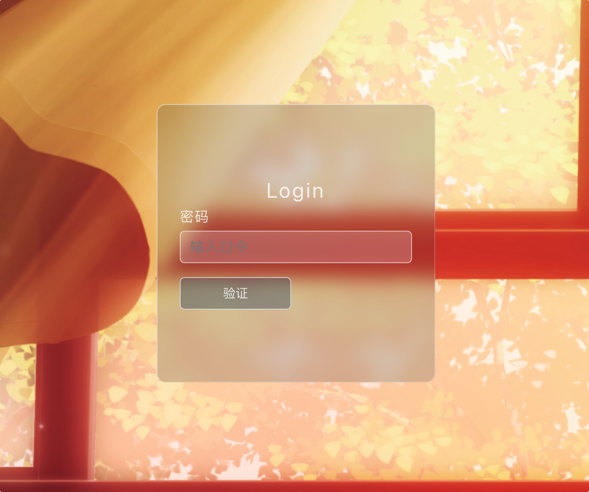
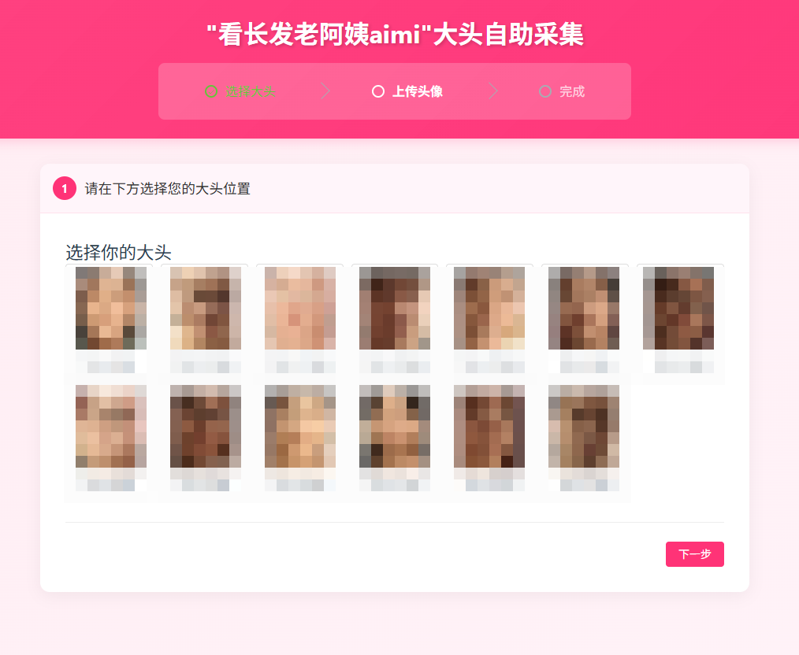
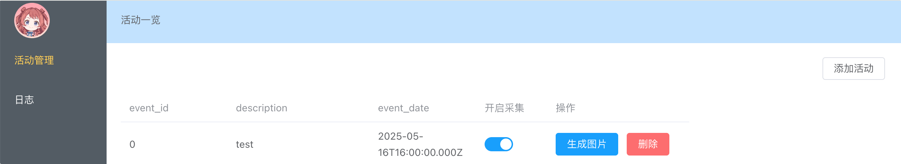

<div align="center">
  <h2><b> 团建合影大头自动覆盖 </b></h2>
</div>


## 项目简介

本人有点脸盲，偶尔见上一两面完全认不清群友哪个是哪个，尤其是某些群友喜欢头像和昵称一块换，p大头的时候更找不到！因此一怒之下搓了这个项目

本项目是一个基于 Vue.js 前端和 Flask 后端的 Web 应用程序，旨在提供用户友好的界面，用于选择预先切割的人脸图片，上传个人头像，并为后续的人脸替换和编辑功能做准备。

* **口令验证：** 线下分发口令，群友通过口令进入特定活动。
* **人脸选择：** 用户可以浏览并选择之前通过人脸识别程序生成的人脸图片。
* **头像上传：** 通过 QQ 号获取头像。
* **图片编辑：** 在后台可以进行活动创建、收集管理和最终的图片导出。在导出前可以对大头进行删除、调整大小、旋转等操作。

## 技术栈

* **前端:** Vue.js
* **后端:** Flask (Python)
* **图像处理 (后端):** dlib, OpenCV (用于人脸识别和裁剪)

## 需要指定的环境变量
1.`frontend/env.production` `VITE_API_BASE_URL`

2.后端： `SECRET_KEY` `ADMIN_PASSWORD`

## How to use

1.使用`crop_faces.py`分割输入图片

2.按以下模版组织活动目录
```
backend/
└── event/
    └── <event_id>/
        ├── input.jpg
        ├── faces_info.json
        ├── cropped_faces/
        │   ├── face_1.jpg
        │   └── ...
        └── upload/
```
## To do
- [x] 404页面等路由守卫功能
- [x] 通过后端创建活动文件夹而无需手动创建
- [x] 更漂亮的UI
- [ ] 适配或取消黑暗模式
- [ ] 统一为vue3语法风格

## 演示
登录页面

选择页面

管理页面

