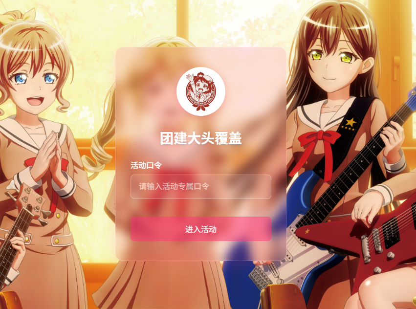

# 团建大头自动覆盖

## 项目简介

本人有点脸盲，偶尔见上一两面完全认不清群友哪个是哪个，尤其是某些群友喜欢头像和昵称一块换，p大头的时候更找不到！因此一怒之下搓了这个项目

本项目是一个基于 Vue.js 前端和 Flask 后端的 Web 应用程序，旨在提供用户友好的界面，用于选择预先切割的人脸图片，上传个人头像，并为后续的人脸替换和编辑功能做准备。

* **口令验证：** 线下分发口令，群友通过口令进入特定活动。
* **人脸选择：** 用户可以浏览并选择之前通过人脸识别程序生成的人脸图片。
* **头像上传：** 通过 QQ 号获取头像。
* **图片编辑：** 在后台可以进行活动创建、收集管理和最终的图片导出。在导出前可以对大头进行删除、调整大小、旋转等操作。

## 技术栈

* **前端:** Vue.js
* **后端:** Flask (Python)
* **UI 库:** Element UI (用于部分组件，如图片选择)
* **图像处理 (后端):** dlib, OpenCV (用于人脸识别和裁剪)

## 演示
登录页面

选择页面

管理页面

